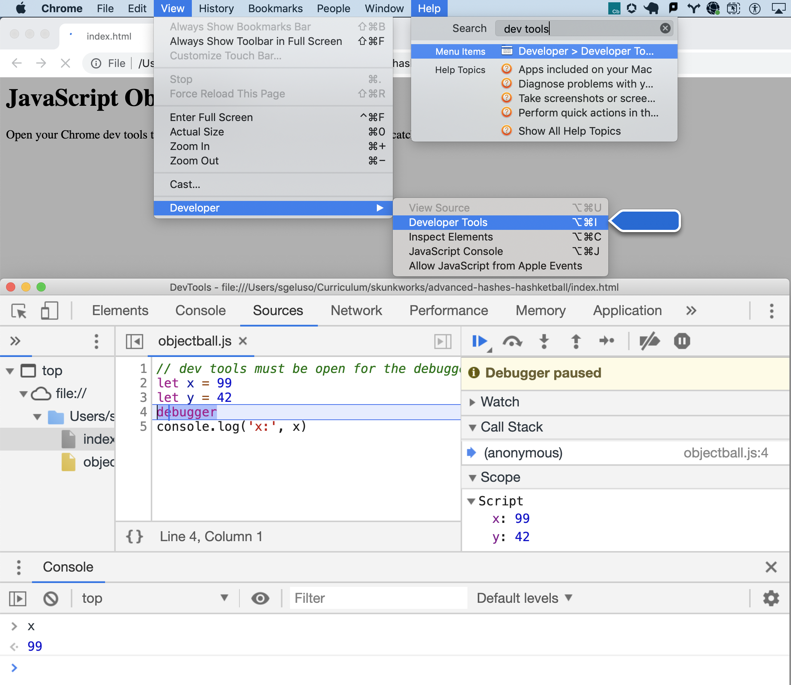

# JavaScript Objectball

## Objectives

1. Practice building nested objects.
2. Practice iterating over nested objects.

## Instructions

Great news! You're going to an NBA game. The only catch is that you've been
volunteered to keep stats at the game.

Fork and clone this lab and run the test suite to get started. You'll be
coding your solution in `objectball.js`.

### Part 1: Building the Object

The first funtion you will define is called `gameObject`. This funtion contains
and returns a object nested in the following manner:

* The top level of the object has two keys: `"home"`, for the home team, and `"away"`, for the away team.
* The values of the `"home"` and `"away"` keys are objects too. These objects have the following keys:
  * `"teamName"`
  * `"colors"`
  * `"players"`
* The `teamName` key points to a string of the team name.
* The `colors` key points to an array of strings that are that team's colors.
* The `players` key points to an object of players whose names (as strings) are
  the keys to a object containing their stats. The values for each player's
  names and their stats can be found in the table below. The stats keys should
  be formatted like this:
  * `"number"`
  * `"shoe"`
  * `"points"`
  * `"rebounds"`
  * `"assists"`
  * `"steals"`
  * `"blocks"`
  * `"slamDunks"`


Use the following data to populate your `gameObject` as outlined above.
Remember to run `learn` to see what the tests expect.

Home Team:

* team name: Brooklyn Nets
* colors: Black, White
* players:


|          Stat          | Info | Info |  Info | Info | Info   |
|:------------------:|:-------------:|:------------:|:------------:|:-------------:|:-------------:|
| **Player Name**    |  Alan Anderson| Reggie Evans | Brook Lopez  | Mason Plumlee | Jason Terry   |
| **Number**         | 0             | 30           | 11           | 1             | 31            |
| **Shoe**           | 16            | 14           | 17           | 19            | 15            |
| **Points**         | 22            | 12           | 17           | 26            | 19            |
| **Rebounds**       | 12            | 12           | 19           | 12            | 2             |
| **Assists**        | 12            | 12           | 10           | 6             | 2             |
| **Steals**         | 3             | 12           | 3            | 3             | 4             |
| **Blocks**         | 1             | 12           | 1            | 8             | 11            |
| **Slam Dunks**     | 1             | 7            | 15           | 5             | 1             |


Away Team:

* team name: Charlotte Hornets
* colors: Turquoise, Purple
* players:

|        Stat       |     Info          |         Info     |              Info |         Info     |         Info      |               
|:------------------:|:-----------------:|:-----------------:|:-----------------:|:---------------:|:-----------------:|
| **Player Name**  | Jeff Adrien     | Bismak Biyombo    | DeSagna Diop      | Ben Gordon      | Brendan Haywood   |
| **Number**         | 4                 | 0                 | 2                 | 8               | 33                |
| **Shoe**           | 18                | 16                | 14                | 15              | 15                |
| **Points**         | 10                | 12                | 24                | 33              | 6                 |
| **Rebounds**       | 1                 | 4                 | 12                | 3               | 12                |
| **Assists**        | 1                 | 7                 | 12                | 2               | 12                |
| **Steals**         | 2                 | 7                 | 4                 | 1               | 22                |
| **Blocks**         | 7                 | 15                | 5                 | 1               | 5                 |
| **Slam Dunks**     | 2                 | 10                | 5                 | 0               | 12                |


### Step 2: Building Functions

### Calling Functions Within Functions
You'll be building a series of functions that operate on the object returned
from the `gameObject` function. Each function will call the `gameObject`
function and then return properties accessed off it.

For example, let's say we want to build a function, `homeTeamName`, that
returns the name of the home team, `"Brooklyn Nets"`. We can call the
`gameHash` function inside of our `homeTeamName` function and operate on the
object:

```js
function homeTeamName()
  let object = gameObject()
  return object['home']['teamName']
}

console.log(homeTeamName())
// logs "Brooklyn Nets"
```

It's possible to access the properties of the object directly off the
function call too. We don't necessarily need to save the result of the
`gameObject` function into a variable. That being said, it's often a good
idea to save results from functions into variables because it makes it easier
to debug our programs later. One-liners are not always better!

```js
function homeTeamName()
  return gameObject()['home']['teamName']
}

console.log(homeTeamName())
// logs "Brooklyn Nets"
```

Now that we understand how we are going to operate on the object that's
returned from `gameObject` inside of other functions we're building, let's
build those functions:

# Debugging JavaScript
We have two options to debug our JavaScript programs:

1. use `console.log()` to print out parts of our program.
2. use a debug tool to pause our program, step through it and inspect values.

Using `console.log()` is an absolutely legitimate debugging technique. Using
a debug tool often offers us more power and leaves less residue in our
programs (because we don't have to delete lots of `console.log()` statements
later. Both have their advantages and disadvantages.

When we run our programs in the command line using `node` we won't have
access to a fancy debugger. Node does have it's own built-in debugger, but
it's just not the best thing in the world. It's not intuitive. It's a bit
hard to use. Check out the docs and see if you like it!

* [Node's debugger documentation](https://nodejs.org/api/debugger.html)

Instead of using `node` to debug or JavaScript programs let's attach our
JavaScript to an HTML page, open that HTML page in Chrome and leverage
Chrome's amazing developer tools.

Here's a sample webpage that doesn't have much content and primarily just
attaches a JavaSCript file:

```html
<h1>JavaScript Objectball</h1>
<p>Open your Chrome dev tools to see console output and trigger the debugger to catch.</p>

<script src="./objectball.js"></script>
```

We can include the `debugger` keyword to stop our program and inspect it with
Chrome's dev tools. Notice, the program will only ever stop if we have the
dev tools open.

```
// dev tools must be open for the debugger to trigger
let x = 99
let y = 42
debugger
console.log('x:', x)
```

* Look at the Sources pane to see your source code and see where the debugger
  has paused your program.
* Observe the Scope section to the right of your source code to see the current
  value of different variables in your program.
* Use your mouse to hover over variables in your source code to see their current value.
* Press ESC to toggle having the console appear at the bottom of your sources
  tab.
* Use the console to type in variable names and see their values.



### Accessing Key Values and Iterating Through Objects
There are three ways to iterate through objects in JavaScript:

* Use a key you know and type the key as a string manually `oo['some_key']`
* Use a key you know and type it after a dot manually `oo.some_key`
* Notice that you can only access keys via the `.` if they have a name like a
  legal JavaScript variable (basically it can't have spaces, you'd have to
  use the string way)

```js
let oo = {foo: 42, bar: 83, 'key w/ spaces': true}
console.log(oo['foo']);
console.log(oo['bar']);
console.log(oo['key w/ spaces']);

console.log(oo.foo);
console.log(oo.bar);

// you can't use the dot to access this key because it has spaces
// console.log(oo.key w/ spaces)
```

Use a for-in loop to iterate over all of the keys and access their value
through brackets:

```js
let oo = {foo: 42, bar: 83, baz: 79}
for (let key in oo) {
  let value = oo[key]
  console.log('key:', key, 'value:', value)
}
```

* Use functions attached to access keys, values, or entries
  * `Object.keys(oo)` returns an array of all keys
  * `Object.values(oo)` returns an array of all values
  * `Object.entries(oo)` returns an array of arrays containing `[key, value]` together

```js
let oo = {foo: 42, bar: 83, baz: 79}
console.log('   Object.keys(oo) =>', Object.keys(oo))
console.log(' Object.values(oo) =>'Object.values(oo))
console.log('Object.entries(oo) =>', Object.entries(oo))
```

```text
   Object.keys(oo) => [ 'foo', 'bar', 'baz' ]
 Object.values(oo) => [ 42, 83, 79 ]
Object.entries(oo) => [ [ 'foo', 42 ], [ 'bar', 83 ], [ 'baz', 79 ] ]
```

### Iterating Through Deeply Nested Objects
```js
function goodPractices()
  let game = gameObject();
  for (let gameKey in game) {
    // are you ABSOLUTELY SURE what 'gameKey' is?
    // use the debugger to find out!
    debugger
    let teamObj = game[gameKey]
    for (let teamKey in teamObj) {
      // are you ABSOLUTELY SURE what 'teamKey' is?
      // use debugger to find out!
      debugger

      // what is 'data' at each loop through out this block?
      // when will the following line of code work and when will it break?
      let data = teamObj.player
      for (let key in data)
        debugger
      }
    }
  }
}
```

Open up the `hashketball.js` file and add the line *require "pry"* at the top
and copy and paste the above function. Then, beneath the `end` that closes the
function definition, call the function (`goodPractices`) and, in your terminal,
run the file with `node hashketball.js`. Play around with the functions in each
binding until you get comfortable with the iteration. This should give you a
stronger sense of how we iterate through so many levels of a nested hash and
what happens on each level. **Use this function of placing LOTS of `debugger`
keywords when you iterate in order to solve this lab.**

Okay, *now* we're ready to build out functions:

### Function Building

* Build a function, `numPointsScored` that takes in an argument of a player's name and returns the number of points scored for that player.
  * Think about where in the hash you will find a player's `:points`. How can you iterate down into that level? Think about the return value of your function. Remember that `.each` returns the original collection that you are iterating over. How can you return the number of points for a particular player?

* Build a function, `shoeSize`, that takes in an argument of a player's name and returns the shoe size for that player.
  * Think about how you will find the shoe size of the correct player. How can you check and see if a player's name matches the name that has been passed into the function as an argument?
* Build a function, `teamColors`, that takes in an argument of the team name and returns an array of that teams colors.
* Build a function, `teamNames`, that operates on the game hash to return an array of the team names.
* Build a function, `playerNumbers`, that takes in an argument of a team name and returns an array of the jersey number's for that team.
* Build a function, `playerStats`, that takes in an argument of a player's name and returns a hash of that player's stats.
  * Check out the following example of the expected return value of the `playerStats` function:


    ```bash
    playerStats("Alan Anderson")
    => { :number => 0,
         :shoe => 16,
         :points => 22,
         :rebounds => 12,
         :assists => 12,
         :steals => 3,
         :blocks => 1,
         :slamDunks => 1
       }
    ```

* Build a function, `bigShoeRebounds`, that will return the number of rebounds
  associated with the player that has the largest shoe size. Break this one
  down into steps:
  * First, find the player with the largest shoe size
  * Then, return that player's number of rebounds
  * Remember to think about return values here. Use `binding.pry` to drop into
    your function and understand what it is returning and why.


**Bonus Questions:**

Define functions to return the answer to the following questions:

1. Which player has the most points? Call the function `mostPointsScored`.

2. Which team has the most points? Call the function `winningTeam`.

3. Which player has the longest name? Call the function `playerWithLongestName`.

**Super Bonus:**

1. Write a function that returns true if the player with the longest name had
   the most steals. Call the function `longNameStealsATon?`.
